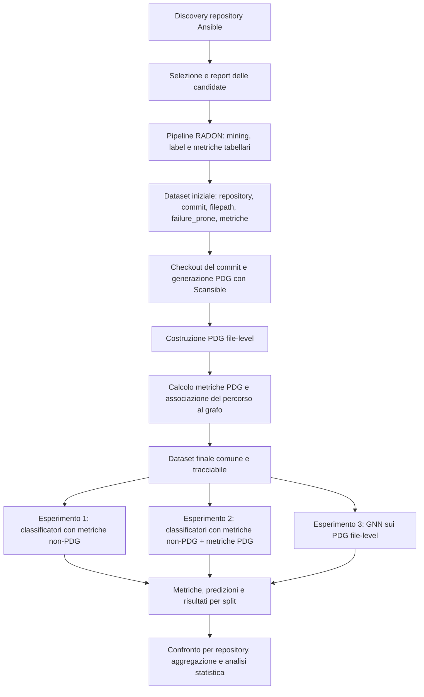

# Contesto del Progetto di Tesi e Roadmap Sperimentale

**Titolo di lavoro:** Defect prediction di file Ansible mediante metriche statiche, metriche derivate da Program Dependence Graph e Graph Neural Network  
**Scopo del documento:** fornire una fonte di verità operativa per comprendere, sviluppare e valutare il progetto  
**Stato del documento:** contesto tecnico e roadmap; non rappresenta un capitolo definitivo della tesi  
**Ultimo aggiornamento:** 9 giugno 2026

---

## 1. Obiettivo della tesi

Il progetto studia il problema della **defect prediction** per file Infrastructure-as-Code scritti per Ansible. L'obiettivo è prevedere se uno specifico file Ansible, in una specifica versione della repository, sia **failure-prone**, cioè associato alla presenza di un difetto, oppure **neutral**.

L'unità di analisi è una riga identificata dalla tupla:

```text
(repository, commit, filepath)
```

Ogni riga possiede almeno:

- l'identificativo della repository;
- il commit a cui si riferisce lo snapshot del file;
- il percorso del file Ansible nella repository;
- la label binaria `failure_prone`;
- un insieme di metriche tabellari estratte dal file e dalla sua storia;
- quando l'estrazione ha successo, metriche derivate dal PDG e un PDG file-level.

La tesi vuole confrontare tre strategie di previsione:

1. classificatori classici addestrati con sole metriche tabellari non-PDG;
2. classificatori classici addestrati con metriche tabellari non-PDG e metriche PDG;
3. Graph Neural Network addestrate direttamente sui PDG file-level.

Il contributo principale non è soltanto costruire tre modelli, ma confrontarli mediante una **linea sperimentale comune**, in modo che le differenze osservate siano attribuibili alla rappresentazione dei dati e al tipo di modello, non a split, campioni o procedure di preprocessing differenti.

> **Principio guida:** il confronto principale deve usare gli stessi campioni, gli stessi split temporali, la stessa label, le stesse regole di preprocessing, lo stesso trattamento dello sbilanciamento e le stesse metriche di valutazione per tutte e tre le strategie.

---

## 2. Domanda di ricerca generale

La domanda generale del lavoro può essere formulata nel modo seguente:

> In un contesto di defect prediction within-project per file Ansible, quale strategia fornisce le prestazioni migliori tra classificatori basati su metriche statiche, classificatori arricchiti con metriche PDG e GNN addestrate sui PDG file-level?

Questa domanda estende la linea di ricerca già presente nei documenti di riferimento:

- il lavoro RADON studia la defect prediction di script IaC mediante metriche product e process;
- il lavoro sulle metriche PDG valuta il valore predittivo di 11 metriche estratte dai Program Dependence Graph e utilizza RFECV per individuare le feature più rilevanti;
- questa tesi aggiunge una terza prospettiva, in cui il grafo non è ridotto soltanto a metriche aggregate, ma viene utilizzato direttamente come input di una GNN per classificazione graph-level.

Una possibile articolazione delle domande di ricerca finali è:

- **RQ1:** quanto sono efficaci i classificatori classici basati sulle sole metriche tabellari non-PDG?
- **RQ2:** l'aggiunta delle metriche PDG migliora i classificatori classici?
- **RQ3:** una GNN che utilizza direttamente i PDG file-level supera le strategie basate su vettori di metriche?
- **RQ4:** quali differenze sono statisticamente e praticamente significative tra le tre strategie?

La formulazione definitiva delle RQ dovrà essere allineata con il capitolo metodologico della tesi.

---

## 3. Basi metodologiche

### 3.1 RADON e defect prediction mediante metriche product/process

Il documento `Within-Project_Defect_Prediction_of_Infrastructure-as-Code_Using_Product_and_Process_Metrics (1).pdf` descrive un framework integrato per:

- raccogliere repository Ansible;
- identificare file failure-prone e neutral;
- estrarre metriche product, process e orientate ad Ansible;
- addestrare e valutare classificatori di defect prediction;
- eseguire una validazione within-project preservando l'ordine temporale.

Questa linea di lavoro costituisce la base del punto di partenza del progetto: il dataset tabellare con label `failure_prone` e metriche utilizzabili da classificatori classici.

### 3.2 Defect prediction mediante metriche PDG

I documenti `Iuliano_Master_Thesis.pdf` e `PAPER_Infrastructure_as_Code_Defect_Prediction_Using_Program_Dependence_Graph_Metrics.pdf` studiano il valore delle metriche derivate dai Program Dependence Graph per file Ansible.

Le 11 metriche PDG considerate sono:

| Metrica | Significato sintetico |
|---|---|
| `maxPdgVertices` | Numero massimo di vertici tra i PDG delle task di un file |
| `lackOfCohesion` | Condivisione di vertici tra le task del file |
| `verticesCount` | Numero di vertici |
| `edgesCount` | Numero di archi |
| `edgesToVerticesRatio` | Rapporto tra archi e vertici |
| `globalInput` | Input non locali o parametri utilizzati |
| `globalOutput` | Variabili non locali modificate |
| `directFanIn` | Dipendenze dirette in ingresso |
| `indirectFanIn` | Dipendenze indirette in ingresso |
| `directFanOut` | Dipendenze dirette in uscita |
| `indirectFanOut` | Dipendenze indirette in uscita |

Il lavoro precedente mostra che le metriche PDG possono essere utilizzate sia isolatamente sia insieme alle metriche già presenti nel dataset RADON. La RQ1 della tesi di Iuliano evidenzia anche che le 11 metriche non hanno lo stesso peso predittivo: RFECV seleziona in mediana quattro feature ottimali e indica come predittori più ricorrenti `maxPdgVertices`, `verticesCount`, `edgesToVerticesRatio` ed `edgesCount`. Nel progetto corrente questa osservazione motiva l'uso della feature selection, ma non impone a priori lo stesso sottoinsieme: E2 usa tutte le 11 metriche PDG come candidate e applica RFECV soltanto sul training set di ogni split.

### 3.3 Estensione proposta: classificazione graph-level con GNN

La terza strategia rappresenta ogni file Ansible mediante un PDG file-level e utilizza una Graph Neural Network per produrre una previsione binaria.

In questa impostazione:

- ogni riga del dataset corrisponde a un grafo;
- i nodi del grafo possiedono feature numeriche e categoriali;
- gli archi rappresentano relazioni di dipendenza o flusso;
- la label globale del grafo è `failure_prone`;
- il modello produce una probabilità o uno score di failure-proneness per il file.

Questa estensione permette di valutare se la topologia e le relazioni interne al PDG contengano informazione predittiva che viene persa quando il grafo è ridotto a un piccolo insieme di metriche.

---

## 4. Pipeline end-to-end



### 4.1 Discovery e selezione delle repository

La cartella `radon_dataset_extraction` contiene una pipeline di discovery GitHub che cerca repository candidate mediante più strategie, tra cui query relative ad Ansible role, collection, playbook, Molecule e topic Ansible.

La discovery:

- recupera i metadata delle repository;
- usa il `default_branch` reale;
- esclude repository archiviate, disabilitate o poco pertinenti;
- deduplica le candidate;
- assegna uno score di priorità;
- produce un file `repo_url,branch`;
- genera report delle repository selezionate ed escluse.

La discovery è una fase di raccolta delle candidate, non una garanzia che ogni repository produca dati validi. La validazione effettiva avviene nella pipeline RADON.

### 4.2 Estrazione del dataset RADON

La pipeline RADON analizza ogni repository candidata e produce un dataset a granularità file-versione. La pipeline:

- verifica che la repository abbia un numero minimo di tag;
- identifica fixing commit e file Ansible coinvolti;
- costruisce gli snapshot etichettati;
- estrae metriche product, process, delta e orientate ad Ansible;
- salva un CSV per repository;
- unisce i dataset delle repository processate con successo;
- applica filtri minimi per mantenere repository adatte a esperimenti within-project.

Il dataset risultante contiene colonne come:

```text
repo_url, branch, repository, commit, committed_at, filepath, failure_prone, ...
```

Le metriche tabellari includono, tra le altre:

- metriche di modifica e processo, come `additions`, `deletions`, `commits_count` e `contributors_count`;
- metriche strutturali del file, come `lines_code`, `num_tasks`, `num_conditions`, `num_tokens` e `text_entropy`;
- metriche delta che descrivono la variazione tra versioni successive.

### 4.3 Checkout dei commit e generazione dei PDG

Per associare un grafo alla riga del dataset è necessario:

1. individuare la repository locale;
2. eseguire il checkout del commit indicato nella riga;
3. individuare il file indicato da `filepath`;
4. invocare Scansible;
5. salvare il PDG e lo stato dell'estrazione;
6. mantenere il collegamento con `repository`, `commit`, `filepath` e `failure_prone`.

La tracciabilità deve essere preservata anche per gli errori. Una riga priva di PDG non deve scomparire senza spiegazione: deve essere associata a uno stato e a una motivazione di esclusione.

### 4.4 Costruzione dei PDG file-level

La pipeline dedicata `pdg_file_level_extraction/scripts/pdg_file_level_extractor.py` raggruppa le righe per repository, clona ogni repository al momento dell'elaborazione, invoca Scansible sui singoli file e salva il risultato in una run configurabile sotto `pdg_file_level`. Al termine delle righe della repository, il clone temporaneo viene eliminato.

Questa modalità produce direttamente il grafo associato al file ed è isolata in un folder autonomo con Dockerfile, requirements, parallelismo sicuro per repository, metadati e resume. La pipeline è self-contained e rappresenta la modalità principale mantenuta nella repository pulita.

Le precedenti utility repo-level e gli script sperimentali usati per costruire sottografi file-level a partire da PDG repository-level sono stati rimossi dalla root, perché non fanno parte della pipeline corrente. Eventuali confronti futuri tra modalità di costruzione del PDG dovranno essere introdotti come nuova macro-fase esplicita, non come script legacy dispersi.

### 4.5 Calcolo delle metriche PDG

Le metriche PDG permettono di trasformare il grafo in un vettore tabellare utilizzabile dai classificatori classici.

Nel progetto sono presenti:

- dataset versionati che includono le 11 metriche PDG;
- la pipeline `dataset_preparation/scripts/build_versioned_dataset.py`, che unisce RADON, status PDG, path dei grafi e metriche PDG;
- report di esclusione che documentano le righe senza PDG valido o senza metriche calcolabili.

Il dataset finale dovrà associare, per ogni riga valida:

```text
repository, commit, filepath, failure_prone,
metriche tabellari non-PDG,
metriche PDG,
graphml_path o percorso equivalente al PDG file-level
```

### 4.6 Creazione del dataset finale comune

Il dataset finale è il punto di ingresso condiviso dai tre esperimenti. Deve essere:

- univocamente identificabile e versionato;
- deduplicato rispetto alla tupla `(repository, commit, filepath)`;
- coerente rispetto alla label;
- limitato, per il confronto principale, alle righe con PDG valido e metriche PDG disponibili;
- corredato da un report delle righe escluse;
- accompagnato da metadati che descrivano origine, data di generazione, filtri e conteggi.

Questa scelta riduce il numero di righe utilizzabili dai classificatori classici rispetto al dataset RADON completo, ma rende il confronto con la GNN sensato: tutti i modelli ricevono gli stessi esempi.

---

## 5. Dati osservati nella repository

I conteggi seguenti descrivono artefatti attualmente presenti nella repository e servono a motivare la necessità di un dataset comune e tracciabile.

| Artefatto | Righe | Colonne | Osservazione |
|---|---:|---:|---|
| `radon_dataset_extraction/output/runs/run_from_discovery_parallel/batch_summary.csv` | 1.000 | 14 | Run RADON basata su 1.000 repository candidate |
| `radon_dataset_extraction/output/runs/run_from_discovery_parallel/merged_dataset.csv` | 79.618 | 130 | Dataset aggregato delle repository con estrazione riuscita |
| `radon_dataset_extraction/output/runs/run_from_discovery_parallel/merged_dataset_filtered.csv` | 61.542 | 130 | Dataset dopo i filtri minimi per repository |
| `output/second_pdg_extraction/input_dataset.csv` | 61.542 | 130 | Snapshot RADON usato dalla seconda estrazione PDG |
| `output/second_pdg_extraction/extraction_status.csv` | 61.542 | 10 | Stato completo della PDG extraction file-level |
| `datasets/ansible-pdg-defect-dataset/final/v2026-06-06/ansible-pdg-defect-dataset_v2026-06-06_final.csv` | 37.796 | 160 | Prima versione finale comune: RADON + status PDG + path GraphML + metriche PDG file-level |

La riduzione da `61.542` righe RADON a `37.796` righe finali mostra che l'estrazione dei PDG può ridurre sensibilmente il dataset disponibile. Le cause possono includere file non supportati, clone o checkout non riusciti, errori Scansible, grafi vuoti o metriche non calcolabili.

Questa riduzione ha conseguenze metodologiche:

- il numero di campioni disponibili per la GNN può essere molto inferiore al dataset iniziale;
- le distribuzioni di repository e classi possono cambiare dopo il filtering;
- le metriche dei classificatori classici non devono essere calcolate su un insieme più grande del dataset GNN nel confronto principale;
- ogni esclusione deve essere documentata per valutare possibili bias di selezione.

### 5.1 Dataset finale versionato `ansible-pdg-defect-dataset v2026-06-06`

La prima versione finale consolidata è stata generata dalla pipeline:

```text
dataset_preparation/scripts/build_versioned_dataset.py
```

Input usati:

- `output/second_pdg_extraction/input_dataset.csv`, snapshot RADON completo da 61.542 righe;
- `datasets/ansible-pdg-defect-dataset/pdg_extraction/extraction_status.csv`, stato della PDG extraction file-level;
- grafi GraphML sotto `output/second_pdg_extraction/pdg_file_level`.

Output principale:

```text
datasets/ansible-pdg-defect-dataset/final/v2026-06-06/
```

Conteggi della versione:

| Fase | Righe |
|---|---:|
| Input RADON filtrato | 61.542 |
| Righe con PDG extraction `SUCCESS` | 37.834 |
| Righe con metriche PDG calcolate | 37.796 |
| Dataset finale | 37.796 |

Distribuzione della label nel dataset finale:

| `failure_prone` | Righe |
|---:|---:|
| 0 | 23.880 |
| 1 | 13.916 |

Le righe escluse sono salvate in:

```text
datasets/ansible-pdg-defect-dataset/final/v2026-06-06/ansible-pdg-defect-dataset_v2026-06-06_exclusions.csv
```

Le motivazioni principali sono:

- file type non supportato dalla PDG extraction file-level;
- fallimento reale di Scansible;
- grafo vuoto;
- grafo sotto soglia di qualità;
- fallimento di clone;
- timeout;
- GraphML non parsabile durante il calcolo delle metriche PDG.

La soglia di qualità usata è conservativa:

```text
min_pdg_nodes = 3
min_pdg_edges = 2
```

Questa soglia coincide con la configurazione della run di estrazione e serve a
rimuovere grafi vuoti, senza archi o placeholder. Non introduce un filtro
aggressivo sulla complessità: file piccoli ma con una dipendenza minima restano
inclusi. La scelta è motivata anche dal fatto che le GNN basate su message
passing richiedono una struttura di nodi e archi significativa; grafi nulli o
edgeless non rappresentano dipendenze utili per il confronto con modelli
tabellari.

#### Nota metodologica sui grafi piccoli

La soglia `3 nodi / 2 archi` deve essere interpretata come soglia di validità
strutturale minima, non come prova che tutti i grafi appena sopra soglia siano
ugualmente informativi per il training.

La letteratura e la documentazione tecnica delle librerie GNN chiariscono che
una GNN basata su message passing richiede nodi e archi per propagare
informazione, ma non forniscono una soglia universale oltre la quale un grafo
diventa predittivamente utile. La questione dipende dal dominio, dalla label, dal
tipo di grafo e dal protocollo sperimentale. Nel nostro caso, i grafi molto
piccoli possono rappresentare file Ansible realmente semplici; eliminarli a
priori potrebbe rimuovere un segnale valido di bassa complessità. Allo stesso
tempo, mantenerli potrebbe favorire scorciatoie del modello, ad esempio
apprendere che grafi piccolissimi sono prevalentemente neutral, invece di
utilizzare relazioni strutturali più ricche.

Una prima analisi descrittiva sulla versione `v2026-06-06` mostra infatti che i
grafi piccoli hanno una distribuzione della label diversa dalla media globale:

| Bucket nodi | Righe | Positive | Positive rate | Repository |
|---|---:|---:|---:|---:|
| `<=3` | 493 | 45 | 0,0913 | 18 |
| `4-5` | 1.410 | 228 | 0,1617 | 48 |
| `6-8` | 1.675 | 511 | 0,3051 | 68 |
| `9-10` | 1.269 | 363 | 0,2861 | 64 |
| `21-32` | 6.168 | 2.229 | 0,3614 | 112 |
| `33-69` | 9.481 | 3.705 | 0,3908 | 115 |
| `70-148` | 5.611 | 2.772 | 0,4940 | 102 |

La media globale del dataset finale è `0,3682`. Quindi i grafi piccolissimi non
sembrano rumore casuale: portano un segnale forte. Tuttavia questo segnale può
essere legato alla dimensione/semplicità del file più che alla struttura
relazionale del PDG. Per questa ragione il dataset principale resta inclusivo,
ma la validità della scelta deve essere verificata sperimentalmente.

La pipeline di training dovrà quindi includere una **small-graph sensitivity
analysis**. L'idea è mantenere `v2026-06-06` come dataset principale e generare,
per analisi controllate, sottoinsiemi derivati con soglie più restrittive, ad
esempio:

| Soglia alternativa | Righe rimosse | Positive rimosse | Positive rate rimosse | Positive rate mantenute |
|---|---:|---:|---:|---:|
| `>=4 nodi, >=3 archi` | 505 | 47 | 0,0931 | 0,3719 |
| `>=5 nodi, >=4 archi` | 1.182 | 175 | 0,1481 | 0,3753 |
| `>=6 nodi, >=5 archi` | 1.947 | 283 | 0,1454 | 0,3803 |
| `>=8 nodi, >=7 archi` | 3.025 | 598 | 0,1977 | 0,3830 |
| `>=10 nodi, >=9 archi` | 4.397 | 990 | 0,2252 | 0,3870 |

Questa analisi non deve sostituire automaticamente il dataset finale. Deve
servire a rispondere a una domanda empirica: la GNN beneficia realmente dei
grafi piccoli, oppure le prestazioni migliorano quando i grafi con struttura
minima vengono esclusi? La risposta dovrà essere valutata sugli stessi split,
con lo stesso preprocessing e con lo stesso protocollo usato per E1, E2 ed E3,
in modo da non confondere l'effetto della soglia con differenze di validazione.

Per verificare empiricamente questo punto, l'esperimento E3 con GraphSAGE è
stato ripetuto quattro volte mantenendo invariati modello, seed, split,
preprocessing e strategia di bilanciamento, e modificando soltanto la soglia
minima di validità del grafo. Le configurazioni confrontate sono state:
`3/2`, `5/4`, `8/6` e `10/6`, dove il primo valore indica il numero minimo di
nodi e il secondo il numero minimo di archi. Le metriche pooled non mostrano un
miglioramento stabile con soglie più restrittive; al contrario, la soglia base
`3/2` resta la migliore su MCC, AUC-PR e AUC-ROC pooled. Per il benchmark
principale si mantiene quindi `min_nodes=3` e `min_edges=2`, usando eventuali
soglie più restrittive solo come analisi di sensibilità secondaria.

Il report della versione è:

```text
datasets/ansible-pdg-defect-dataset/final/v2026-06-06/DATASET_REPORT.md
```

Il manifest riproducibile è:

```text
datasets/ansible-pdg-defect-dataset/final/v2026-06-06/manifest.json
```

---

## 6. I tre esperimenti

| Esperimento | Rappresentazione di input | Famiglia di modelli | Scopo |
|---|---|---|---|
| E1 | Metriche tabellari non-PDG | Classificatori classici | Stabilire la baseline sul dataset comune |
| E2 | Metriche tabellari non-PDG + 11 metriche PDG candidate | Classificatori classici | Misurare il valore aggiunto delle metriche PDG con feature selection train-only |
| E3 | PDG file-level con feature di nodi e archi | GNN graph-level | Valutare il valore della struttura completa del grafo |

### 6.1 Esperimento 1: metriche tabellari non-PDG

Il primo esperimento rappresenta ogni riga mediante metriche tabellari già presenti nel dataset RADON, escludendo le metriche PDG.

Nel documento e nel codice finale dovrà essere definito in modo esplicito il feature set adottato. In particolare, il termine "metriche statiche" deve essere usato con attenzione, perché il dataset contiene sia metriche strutturali del file sia metriche di processo e delta.

La scelta consigliata è mantenere un nome tecnico non ambiguo, ad esempio:

```text
TABULAR_NON_PDG = product/ICO + process + delta
```

Se la tesi vuole valutare soltanto le metriche strettamente statiche, questa deve diventare una configurazione distinta e documentata.

### 6.2 Esperimento 2: metriche tabellari non-PDG e metriche PDG

Il secondo esperimento usa gli stessi classificatori e lo stesso protocollo del primo, aggiungendo tutte le 11 metriche PDG già calcolate nel dataset finale:

```text
maxPdgVertices
lackOfCohesion
verticesCount
edgesCount
edgesToVerticesRatio
globalInput
globalOutput
directFanIn
indirectFanIn
directFanOut
indirectFanOut
```

Le metriche PDG vengono trattate come feature candidate. La pipeline applica RFECV, oppure RFE se configurato, usando soltanto il training set di ogni split. Validation e test non partecipano alla selezione delle feature. In questo modo la selezione resta data-driven sul dataset corrente e non deriva automaticamente dal sottoinsieme trovato nel lavoro precedente.

La differenza tra E1 ed E2 deve essere limitata al feature set. Split, campioni, preprocessing, bilanciamento, ricerca degli iperparametri e metriche di valutazione devono restare invariati.

Questo esperimento risponde direttamente alla domanda: le metriche PDG aggregate aggiungono informazione predittiva rispetto alle metriche già disponibili?

### 6.3 Esperimento 3: GNN sui PDG file-level

Il terzo esperimento usa i grafi associati alle stesse righe dei primi due esperimenti.

La pipeline GNN corrente costruisce feature nodali basate su:

- indicatore di nodo task;
- grado in ingresso, grado in uscita e grado totale;
- tipo del nodo codificato one-hot;
- caratteristiche testuali dell'etichetta;
- numero di attributi;
- presenza di informazioni di posizione.

Per gli archi viene estratto un tipo di relazione numerico. Sono presenti implementazioni per:

- GCN;
- GraphSAGE;
- GAT;
- GIN;
- R-GCN.

La GNN esegue una classificazione graph-level tramite pooling delle rappresentazioni nodali e un classificatore finale.

Prima dell'esperimento definitivo la pipeline deve essere consolidata, in particolare rispetto a:

- validazione dei grafi e gestione dei grafi vuoti;
- uso effettivo delle feature degli archi nei modelli che le supportano;
- coerenza tra `edge_attr`, `edge_type` e R-GCN;
- configurazione riproducibile degli iperparametri;
- salvataggio del modello migliore e valutazione coerente sul test set;
- aggregazione dei risultati su tutti gli split.

---

## 7. Protocollo sperimentale comune

### 7.1 Invarianti di confronto

Per ogni split sperimentale:

- E1, E2 ed E3 devono usare le stesse righe;
- la label deve essere sempre `failure_prone`;
- il test set deve rappresentare dati temporalmente successivi al training set;
- il validation set deve essere creato prima di qualsiasi bilanciamento;
- il test set non deve essere bilanciato;
- le trasformazioni devono essere apprese soltanto dal training set;
- la procedura deve essere riproducibile mediante seed e configurazioni salvate.

### 7.2 Validazione within-project walk-forward

Il protocollo principale deve essere una validazione **within-project walk-forward**:

1. raggruppare i dati per repository;
2. ordinare i commit cronologicamente;
3. usare i commit precedenti come training set;
4. usare il commit successivo come test set;
5. ripetere il processo fino all'ultimo commit disponibile;
6. aggregare i risultati dei diversi split.

Questo schema preserva l'ordine temporale ed evita di addestrare un modello usando informazioni provenienti dal futuro rispetto al test set.

La logica walk-forward è ora centralizzata in `experiments/common/splitting.py` ed è riusata da E1, E2 ed E3.

### 7.3 Validation set

Il validation set deve essere estratto dal training set in modo temporale, quando il numero di commit lo consente. Se è necessario un fallback per casi con pochi commit, il comportamento deve essere:

- esplicito;
- identico per tutti gli esperimenti;
- registrato nei metadati dello split;
- valutato come possibile minaccia alla validità.

Gli split con una sola classe in training o test vengono esclusi prima del
training, perché non permettono una valutazione robusta di metriche come MCC e
AUC. Gli split con test set piccolo ma contenente entrambe le classi vengono
invece mantenuti nel benchmark principale: sono temporalmente validi e, usando
metriche pooled, non pesano quanto split più grandi. La loro influenza viene
valutata con un'analisi post-hoc di affidabilità degli split.

### 7.4 Preprocessing

Il preprocessing deve essere definito per famiglia di input, mantenendo la stessa informazione temporale.

Per E1 ed E2:

- selezionare le colonne di feature;
- gestire valori mancanti e non finiti;
- applicare eventuale normalizzazione o standardizzazione;
- apprendere ogni trasformazione soltanto sul training set;
- applicare la trasformazione appresa a validation e test.

Per E3:

- costruire feature nodali e degli archi in modo deterministico;
- applicare eventuali scaler alle feature numeriche usando soltanto i grafi di training;
- mantenere invariata la struttura dei grafi di validation e test;
- evitare qualunque uso delle label o dei dati di test durante il preprocessing.

### 7.5 Bilanciamento delle classi

La defect prediction è tipicamente caratterizzata da una classe failure-prone minoritaria.

Il bilanciamento deve essere applicato:

- soltanto al training set;
- dopo la creazione di validation e test;
- con seed riproducibile;
- senza modificare validation e test.

La logica di bilanciamento è ora centralizzata in `experiments/common/balancing.py` e supporta `none`, `random_undersampling` e `random_oversampling`. La strategia viene applicata solo al training set per tutti gli esperimenti. Eventuali tecniche sintetiche, come SMOTE, richiedono una valutazione separata perché non sono direttamente equivalenti per dati tabellari e grafi.

Una prima analisi controllata su E3 GraphSAGE ha confrontato le tre strategie disponibili mantenendo invariati dataset, soglia grafi `3/2`, split, seed, modello e iperparametri. I risultati pooled sono:

| Strategia | MCC | AUC-PR | AUC-ROC | Precision | Recall | F1 | Accuracy | Positive rate predetto |
|---|---:|---:|---:|---:|---:|---:|---:|---:|
| `none` | 0,487 | 0,588 | 0,791 | 0,611 | 0,783 | 0,687 | 0,745 | 0,458 |
| `random_oversampling` | 0,563 | 0,643 | 0,818 | 0,646 | 0,842 | 0,731 | 0,779 | 0,465 |
| `random_undersampling` | 0,430 | 0,543 | 0,743 | 0,573 | 0,763 | 0,655 | 0,713 | 0,476 |

Tutte le run usano 1.706 split validi e 25.062 predizioni test, con positive rate reale pari a circa 0,357. `random_oversampling` migliora tutte le metriche principali rispetto a `none` e `random_undersampling`, riducendo anche i falsi negativi senza aumentare i falsi positivi rispetto a `none`. Per il benchmark principale viene quindi adottato `random_oversampling` come strategia di bilanciamento comune, sempre applicata solo al training set. `none` resta una baseline diagnostica secondaria; `random_undersampling` non è consigliata perché perde informazione utile e peggiora tutte le metriche pooled.

### 7.6 Selezione dei modelli e iperparametri

I classificatori classici dovrebbero includere almeno modelli coerenti con i lavori precedenti, ad esempio:

- Logistic Regression;
- Naive Bayes;
- Decision Tree;
- Random Forest;
- Support Vector Machine.

La selezione degli iperparametri deve avvenire senza usare il test set. Il criterio di selezione consigliato è `MCC`, perché è adatto a classificazione binaria sbilanciata.

Per le GNN, lo spazio di ricerca deve essere definito in modo controllato e confrontabile, includendo almeno:

- architettura;
- numero di layer;
- dimensione hidden;
- dropout;
- learning rate;
- batch size;
- funzione di pooling;
- numero massimo di epoche;
- criterio di early stopping.

### 7.7 Metriche di valutazione

Tutti gli esperimenti devono produrre almeno:

| Metrica | Motivazione |
|---|---|
| `precision` | Misura l'affidabilità delle predizioni failure-prone |
| `recall` | Misura quanti file failure-prone vengono individuati |
| `F1` | Bilancia precision e recall |
| `MCC` | Fornisce una misura robusta per classi sbilanciate |
| `AUC-PR` | Valuta il ranking delle predizioni con attenzione alla classe positiva |

`MCC` e `AUC-PR` devono ricevere particolare attenzione nell'interpretazione finale.

Per il confronto finale, precision, recall, F1, MCC, AUC-PR e AUC-ROC devono essere riportate principalmente in forma pooled: prima si aggregano tutte le predizioni dei test set walk-forward e poi si calcolano le metriche sul totale. Le medie semplici per split restano utili come diagnostica, ma non devono essere l'unico risultato principale, perché split con pochissimi campioni o poche istanze positive possono introdurre molto rumore.

La prima analisi di affidabilità sugli split E3 GraphSAGE ha confermato che
filtrare rigidamente gli split piccoli migliora poco o in modo non stabile le
metriche principali, eliminando però una quota rilevante delle predizioni test.
Per il benchmark principale si mantengono quindi tutti gli split validi; come
diagnostica secondaria si può riportare il filtro `min_test_size=10`,
`min_test_positives=2`, `min_test_negatives=1`.

### 7.8 Artefatti da salvare

Ogni run deve salvare:

- configurazione completa;
- identificativo del dataset;
- identificativo dello split;
- liste o identificativi dei campioni di train, validation e test;
- distribuzione delle classi prima e dopo il bilanciamento;
- trasformazioni applicate;
- iperparametri selezionati;
- predizioni e score sul test set;
- metriche per split;
- risultati aggregati per repository;
- risultati aggregati globali;
- tempi di esecuzione;
- errori ed esclusioni.

---

## 8. Stato attuale dell'implementazione

| Area | Stato | Evidenza principale | Note |
|---|---|---|---|
| Discovery repository Ansible | Implementata | `radon_dataset_extraction/scripts/discover_ansible_repos.py` | Produce candidate e report metodologici |
| Estrazione dataset RADON | Implementata | `radon_dataset_extraction/scripts/run_full_pipeline.py` | Supporta resume, parallelismo, filtri e metadati |
| Dataset aggregato e filtrato | Implementato | `merged_dataset.csv`, `merged_dataset_filtered.csv` | Usato come sorgente RADON della versione finale `ansible-pdg-defect-dataset v2026-06-06` |
| Estrazione PDG file-level diretta | Implementata, da consolidare | `pdg_file_level_extraction/scripts/pdg_file_level_extractor.py` | Pipeline batch isolata con clone temporanei, cleanup per repository, status per riga e parallelismo tra repository |
| Metriche PDG | Implementate per la prima versione finale | `dataset_preparation/scripts/build_versioned_dataset.py`, `ansible-pdg-defect-dataset_v2026-06-06_pdg_metrics.csv` | Le metriche sono calcolate sul GraphML file-level; alcune semantiche sono proxy documentate con `pdg_metric_semantics=file_level_proxy_v1` |
| Caricamento e preprocessing grafi | Implementato nella pipeline finale | `experiments/e3_gnn/graph_loader.py`, `experiments/e3_gnn/graph_data.py`, `experiments/e3_gnn/feature_engineering.py` | Include GraphML/DOT, feature nodali deterministiche ed edge type |
| Split walk-forward e bilanciamento | Centralizzati | `experiments/common/splitting.py`, `experiments/common/balancing.py` | Riutilizzati da E1, E2 ed E3 |
| Training GNN | Implementato e configurabile | `experiments/e3_gnn/run.py`, `experiments/e3_gnn/training.py`, `experiments/e3_gnn/models.py` | Supporta GCN, GraphSAGE, GAT, GIN e R-GCN, early stopping e checkpoint |
| Classificatori classici finali | Implementati | `experiments/e1_tabular_baseline/run.py`, `experiments/e2_tabular_pdg/run.py`, `experiments/common/classical.py` | E2 usa le 11 metriche PDG candidate con RFECV train-only |
| Confronto finale e analisi statistica | Prima utility implementata | `experiments/compare_results.py` | Produce confronto descrittivo e Wilcoxon paired quando possibile |

### 8.1 Punti di forza già presenti

- La pipeline RADON è strutturata e riproducibile.
- Le run RADON salvano report, metadati e stati delle repository.
- Sono presenti dataset reali ed esempi di estrazione PDG.
- La pipeline sperimentale finale è sotto `experiments/` e usa moduli condivisi per data loading, split, preprocessing, balancing, evaluation, reporting e riproducibilità.
- E1, E2 ed E3 salvano config, metadata, split manifest, predizioni, metriche e report in un formato confrontabile.

### 8.2 Lacune principali

- La configurazione sperimentale finale è stata parzialmente congelata dopo la fase esplorativa: soglia grafi `3/2`, mantenimento degli split validi e bilanciamento `random_oversampling`.
- La prima run completa E3 GraphSAGE è stata eseguita e ha evidenziato criticità da documentare: split piccoli, MCC non definito in alcuni casi, variabilità tra repository e tendenza a predire più positivi del reale.
- Le metriche aggregate sono state arricchite con metriche pooled calcolate sulle predizioni aggregate; restano da consolidare metriche pesate per numero di test sample e bucket per dimensione del test set.
- E1 ed E2 devono ancora essere eseguiti con la configurazione comune fissata dalla fase esplorativa.
- Il confronto statistico è presente come base, ma Friedman/Nemenyi e ulteriori effect size restano da consolidare.

---

## 9. Roadmap di lavoro

| Fase | Obiettivo | Output atteso |
|---:|---|---|
| 1 | Consolidare il dataset finale comune | Prima versione prodotta: `datasets/ansible-pdg-defect-dataset/final/v2026-06-06` |
| 2 | Centralizzare split, preprocessing e bilanciamento | Modulo condiviso e manifest degli split |
| 3 | Implementare uniformemente E1 ed E2 | Pipeline dei classificatori classici e risultati per split |
| 4 | Rafforzare E3 | Pipeline GNN robusta, configurabile e riproducibile, inclusa sensitivity analysis sui grafi piccoli |
| 5 | Raccogliere e confrontare i risultati | Tabelle finali, analisi statistica e materiale per la tesi |

### 9.1 Fase 1: consolidamento del dataset finale

Attività:

- scegliere la modalità principale di costruzione del PDG file-level;
- completare l'estrazione dei PDG sul dataset recente;
- calcolare e unire le metriche PDG;
- deduplicare la tupla `(repository, commit, filepath)`;
- verificare la coerenza di `failure_prone`;
- produrre un report delle righe mantenute ed escluse;
- salvare un manifest con conteggi per repository e classe.

Criterio di completamento:

> Esiste un dataset finale unico da cui è possibile ricostruire sia i vettori tabellari sia il percorso del grafo per ogni campione.

### 9.2 Fase 2: centralizzazione della linea sperimentale

Attività:

- estrarre la logica di split in una componente condivisa;
- generare un manifest degli split riutilizzabile;
- definire il comportamento per repository con pochi commit o una sola classe;
- centralizzare seed, validation, bilanciamento e logging;
- definire trasformazioni train-only.
- permettere alla pipeline di ricevere un filtro di dataset derivato, ad esempio
  una soglia minima su nodi e archi, mantenendo invariati split e protocollo.

Criterio di completamento:

> Dato uno split, E1, E2 ed E3 ricevono gli stessi identificativi di train, validation e test.

La sensitivity analysis sui grafi piccoli deve riutilizzare questa infrastruttura:
per ogni soglia alternativa, gli esperimenti devono essere eseguiti sul
sottoinsieme comune risultante, rigenerando o filtrando gli split in modo
deterministico e documentato.

### 9.3 Fase 3: implementazione degli esperimenti classici

Attività:

- definire i feature set E1 ed E2;
- implementare i classificatori selezionati;
- implementare tuning e selezione sul validation set;
- salvare predizioni, score e metriche;
- verificare che l'unica differenza tra E1 ed E2 sia l'aggiunta delle metriche PDG.

Criterio di completamento:

> Per ogni split sono disponibili risultati riproducibili di E1 ed E2 sullo stesso test set.

### 9.4 Fase 4: rafforzamento della pipeline GNN

Attività:

- validare il parsing dei grafi e le feature;
- gestire correttamente grafi vuoti o non validi;
- verificare l'uso delle relazioni degli archi;
- aggiungere una small-graph sensitivity analysis con soglie configurabili. La
  prima analisi è stata eseguita su GraphSAGE con `3/2`, `5/4`, `8/6` e `10/6`;
- salvare per ogni soglia conteggi rimossi, distribuzione delle classi,
  repository rappresentate, risultati per split e differenza rispetto al dataset
  principale;
- rendere configurabili architetture e iperparametri;
- implementare tuning, early stopping e caricamento del modello migliore;
- salvare predizioni e risultati nello stesso formato di E1 ed E2.

Criterio di completamento:

> E3 produce, per ogni split, lo stesso contratto di output degli esperimenti classici e documenta se le prestazioni sono robuste rispetto alla rimozione progressiva dei grafi molto piccoli.

### 9.5 Fase 5: confronto finale

Attività:

- aggregare metriche per repository;
- calcolare statistiche descrittive globali;
- confrontare le strategie con test statistici appropriati;
- riportare anche effect size e non soltanto p-value;
- analizzare fallimenti, casi discordanti e possibili bias;
- preparare tabelle e figure per la tesi.

Criterio di completamento:

> È possibile rispondere alle domande di ricerca con risultati riproducibili, confrontabili e supportati da analisi statistica.

---

## 10. Contratto del dataset finale

Il dataset finale dovrebbe contenere almeno le seguenti categorie di colonne.

| Categoria | Esempi |
|---|---|
| Identificativi | `repository`, `repo_url`, `branch`, `commit`, `committed_at`, `filepath` |
| Label | `failure_prone` |
| Metriche non-PDG | metriche product/ICO, process e delta |
| Metriche PDG | le 11 metriche elencate nella Sezione 3.2, usate da E2 come candidate per RFECV/RFE |
| Percorsi del grafo | `graphml_path`, eventuale `dot_path` |
| Stato di estrazione | `status`, `error`, eventuali conteggi di nodi e archi |
| Provenienza | identificativo della run RADON e della run PDG |

Vincoli minimi:

- la tupla `(repository, commit, filepath)` è univoca;
- `failure_prone` è sempre interpretabile come `0` o `1`;
- i percorsi ai grafi delle righe mantenute esistono e sono leggibili;
- le metriche richieste dal feature set non contengono valori mancanti non gestiti;
- ogni riga esclusa è presente in un report separato con motivazione.

---

## 11. Confronto e analisi dei risultati

Il confronto finale deve essere presentato a più livelli.

### 11.1 Risultati per split

Servono per:

- verificare la variabilità temporale;
- identificare split problematici;
- controllare il numero di esempi positivi e negativi;
- mantenere la massima tracciabilità.

### 11.2 Risultati per repository

Servono per:

- evitare che repository molto grandi dominino l'analisi;
- osservare in quali progetti una strategia funziona meglio;
- analizzare la generalità dei risultati.

### 11.3 Risultati aggregati

Servono per:

- sintetizzare le prestazioni complessive;
- confrontare media, mediana e dispersione;
- produrre tabelle e grafici leggibili.

### 11.4 Analisi statistica

L'analisi statistica deve:

- confrontare le strategie sugli stessi repository o split;
- utilizzare test compatibili con dati appaiati;
- correggere confronti multipli quando necessario;
- riportare effect size;
- distinguere significatività statistica e rilevanza pratica.

La scelta definitiva dei test deve dipendere dalla distribuzione e dalla struttura dei risultati prodotti.

---

## 12. Rischi e minacce alla validità

### 12.1 Riduzione del dataset dopo l'estrazione PDG

Il dataset finale può rappresentare soltanto i file per cui è stato possibile estrarre un PDG valido. Questo può introdurre un bias se i file esclusi hanno caratteristiche sistematicamente diverse.

Mitigazione:

- salvare tutti gli stati di estrazione;
- confrontare distribuzioni prima e dopo il filtering;
- riportare conteggi e motivazioni delle esclusioni.

### 12.2 Qualità delle label

La label `failure_prone` dipende dal mining dei fixing commit e dall'identificazione dei file associati ai difetti. Errori o incompletezze in questa fase influenzano tutti gli esperimenti.

Mitigazione:

- mantenere la provenienza della label;
- documentare la procedura RADON;
- non modificare la label tra gli esperimenti.

### 12.3 Leakage temporale

Usare dati futuri nel training, nella normalizzazione o nel tuning produrrebbe risultati eccessivamente ottimistici.

Mitigazione:

- usare split walk-forward;
- apprendere trasformazioni soltanto sul training set;
- non usare il test set per selezione o tuning.

### 12.4 Confronto non equo tra modelli

Confrontare E1 ed E2 su più righe rispetto a E3 renderebbe impossibile attribuire le differenze alla strategia.

Mitigazione:

- usare il sottoinsieme comune con PDG valido nel confronto principale;
- riportare eventuali analisi aggiuntive sul dataset RADON completo come risultati secondari separati.

### 12.5 Repository con pochi campioni o una sola classe

Una repository con pochi commit, pochi esempi failure-prone o una sola classe può non permettere un esperimento within-project affidabile.

Mitigazione:

- definire soglie minime prima dell'esperimento;
- documentare le repository escluse;
- non applicare procedure di bilanciamento che creino una falsa impressione di informazione disponibile.

### 12.6 Grafi PDG molto piccoli

Un grafo PDG molto piccolo può essere tecnicamente valido ma poco informativo dal
punto di vista strutturale. Allo stesso tempo, nel dominio Ansible, un grafo
piccolo può rappresentare un file realmente semplice e quindi contenere un
segnale predittivo legato alla complessità. Escluderlo a priori può introdurre
un bias opposto: rimuovere soprattutto esempi neutral e rendere il dataset finale
artificialmente più failure-prone.

Nel dataset `ansible-pdg-defect-dataset v2026-06-06`, i grafi con `<=3` nodi
hanno un positive rate di circa `0,0913`, molto inferiore alla media globale
`0,3682`. Questa differenza mostra che la dimensione del grafo è informativa, ma
non chiarisce se tale informazione derivi da struttura PDG utile o da una
correlazione semplice tra dimensione del file e label.

Mitigazione:

- mantenere il dataset principale con la soglia minima conservativa `3 nodi / 2
  archi`;
- non presentare questa soglia come soglia metodologica definitiva di utilità;
- eseguire una small-graph sensitivity analysis nella pipeline di training;
- confrontare soglie progressive mantenendo costanti split, preprocessing,
  modelli e metriche;
- riportare sia l'effetto sulle prestazioni sia l'effetto sulla distribuzione
  delle classi e delle repository.

---

## 13. Convenzioni terminologiche

| Termine | Uso nel progetto |
|---|---|
| File Ansible | Artefatto IaC oggetto della previsione |
| Snapshot | Versione di un file a uno specifico commit |
| Campione | Riga identificata da `(repository, commit, filepath)` |
| `failure_prone` | Label binaria: `1` failure-prone, `0` neutral |
| Metriche tabellari non-PDG | Metriche product/ICO, process e delta, da definire nel feature set |
| Metriche PDG | Le metriche aggregate derivate dal PDG; il dataset ne contiene 11 ed E2 le usa come candidate con feature selection train-only |
| PDG file-level | Grafo associato a un singolo file Ansible |
| Esperimento | Una strategia completa di rappresentazione, modello e valutazione |
| Split | Partizione temporale train/validation/test |
| Bilanciamento | Modifica della distribuzione delle classi applicata soltanto al training set |

---

## 14. Struttura rilevante della repository

```text
radon_dataset_extraction/
  Pipeline di discovery, mining RADON, merge, filtering e metadati delle run.

dataset_preparation/
  Analisi qualità, filtering, arricchimento PDG e costruzione del dataset finale versionato.

pdg_file_level_extraction/
  Pipeline batch isolata per l'estrazione diretta dei PDG file-level tramite Scansible.

experiments/
  Pipeline finali E1, E2 ed E3, moduli comuni, configurazioni, sensitivity analysis e confronto risultati.

output/
  Output delle estrazioni PDG e delle run sperimentali.

datasets/
  Dataset selezionati, versionati e corredati da manifest/report.

docs/
  Documenti accademici di riferimento e questo documento di contesto.
```

---

## 15. Criteri di successo del progetto

Il lavoro può considerarsi pronto per il confronto finale quando:

- esiste un dataset finale comune, versionato e tracciabile;
- ogni campione possiede label, metriche necessarie e PDG file-level valido;
- gli split walk-forward sono salvati e riutilizzati da tutti gli esperimenti;
- preprocessing e bilanciamento non introducono leakage;
- E1, E2 ed E3 producono predizioni e metriche nello stesso formato;
- i risultati sono disponibili per split, repository e aggregazione globale;
- la sensitivity analysis sui grafi piccoli è disponibile e documenta la
  robustezza delle conclusioni rispetto alle soglie minime di nodi e archi;
- il confronto include metriche adatte allo sbilanciamento e analisi statistica;
- ogni esclusione, errore e scelta metodologica è documentata.

---

## 16. Riferimenti presenti nella repository

- Dalla Palma, Di Nucci, Palomba, Tamburri, **Within-Project Defect Prediction of Infrastructure-as-Code Using Product and Process Metrics**. File: `docs/Within-Project_Defect_Prediction_of_Infrastructure-as-Code_Using_Product_and_Process_Metrics (1).pdf`.
- Iuliano, **Master Thesis** sulle metriche PDG per Ansible e defect prediction. File: `docs/Iuliano_Master_Thesis.pdf`.
- Pontillo et al., **Infrastructure-as-Code Defect Prediction Using Program Dependence Graph Metrics**. File: `docs/PAPER_Infrastructure_as_Code_Defect_Prediction_Using_Program_Dependence_Graph_Metrics.pdf`.

Questi lavori costituiscono la base metodologica per dataset, label, metriche e validazione. La pipeline GNN rappresenta l'estensione sperimentale specifica di questa tesi.
